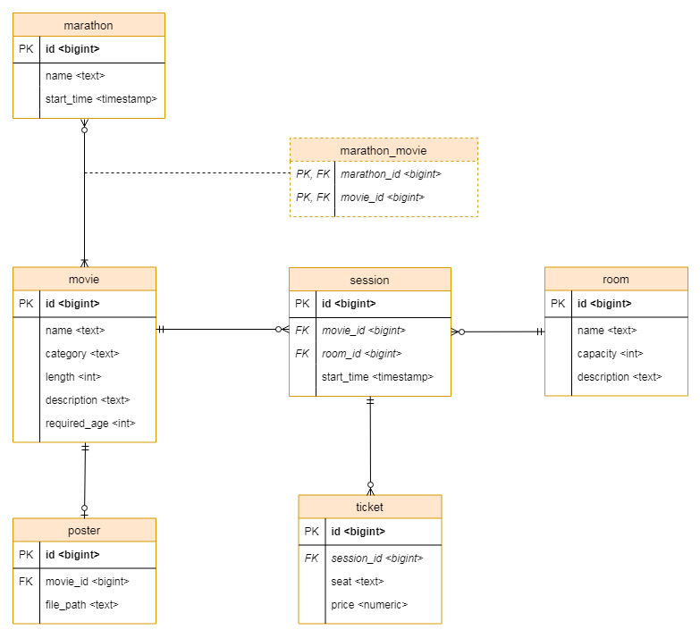

# Cinema System
### Simple web-based cinema management application
The application allows you to:
* create  new ticket for the movie show
* getting all tickets for screening
* cancel the ticket
* create new movie show
* downloading the data of one session
* download a list of screenings on a given day 
* remove movie
* create a new movie 
* downloading the data from one movie 
* downloading a list of movies in a given category (paging)
* downloading a list of movies in part of the title (paging)
* downloading a list of all the movies (paging)
* modification of film data.
* delete movie
* crate a film marathon
* downloading data from one marathon
* download the list of marathons
* remove marathon 

Structure of the data in the database according to the following ERD diagram

Technologies used:
- Java 8+,
- Spring Boot 2+,
- Spring Framework 5+
- JPA (Spring Data JPA and Hibernate),
- Postgresql
- REST API

#
### Prosta aplikacja webowa do zarządzania kinem
Aplikacja umożliwia:
* utworzenie nowego biletu na seans
* pobranie wszystkich biletów na seans
* anulowanie biletu
* utworzenie nowego seansu
* pobranie danych jednego seansu
* pobranie listy seansów w danym dniu
* usunięcie seansu
* utworzenie nowego filmu
* pobranie danych jednego filmu
* pobranie listy filmów w danej kategorii (stronicowanie)
* pobranie listy filmów po części tytułu (stronicowanie)
* pobranie listy wszystkich filmów (stronicowanie)
* modyfikacja danych filmu
* usunięcie filmu
* utworzenie maratonu filmowego
* pobranie danych jednego maratonu
* pobranie listy maratonów
* usunięcie maratonu

Struktura danych w bazie danych zgodnie z poniższym diagramem ERD

Wykorzystystane technologie:
- Java 8+,
- Spring Boot 2+,
- Spring Framework 5+
- JPA (Spring Data JPA i Hibernate),
- Postgresql
- REST API

IDE: [IntelliJ IDEA](https://www.jetbrains.com/idea/)
